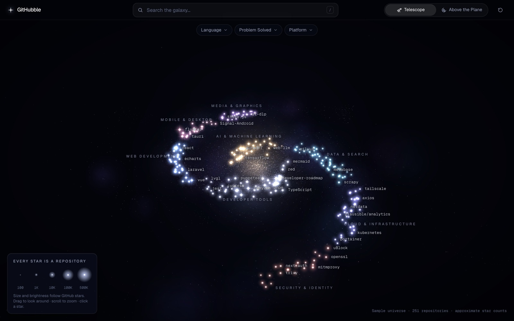
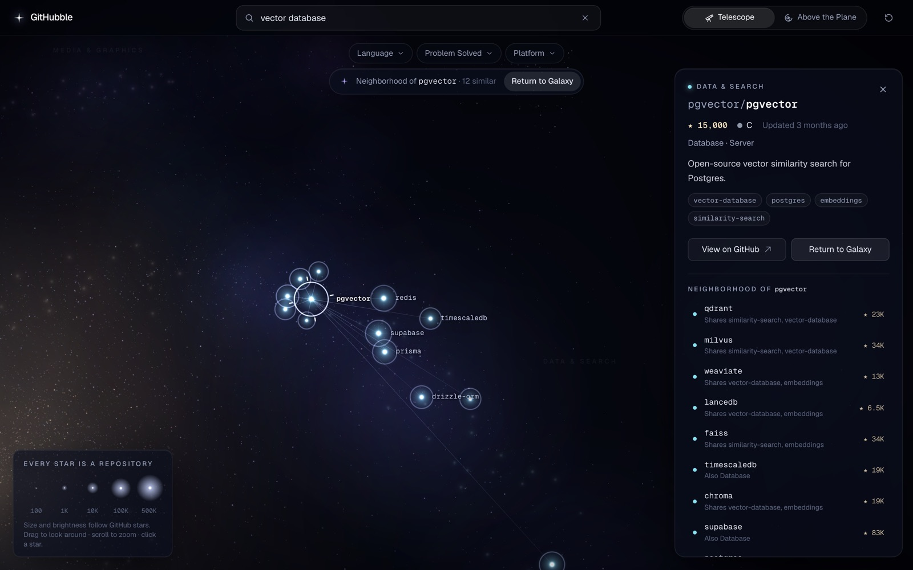
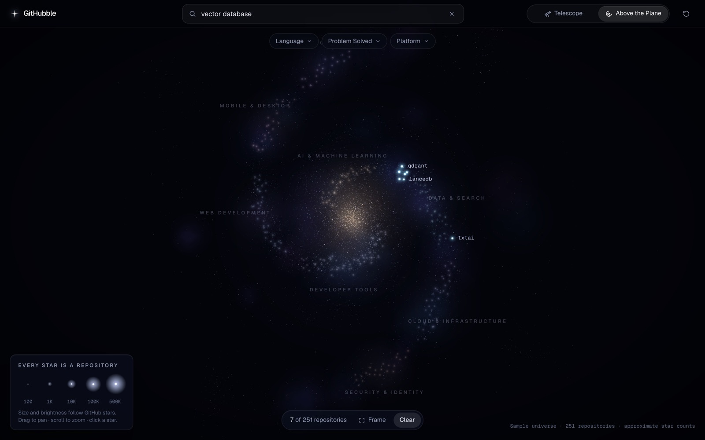

# GitHubble

**Your telescopic view into repo galaxies.**

GitHubble is a visual discovery interface for public GitHub repositories. Instead of scrolling
search-result lists, you explore repositories as a navigable galaxy:

- **Every repository is a star.** More GitHub stars → a larger, brighter star (log scale).
- **Similar repositories sit near each other.** Categories form neighborhoods along spiral arms.
- **Search and filters** light up matching stars and dim the rest, so the surrounding
  neighborhood stays visible as context.



## Status

**Phase 1 (Fake Universe) is complete, and Phase 2 (Real Universe) is built.** The importer
pulls real repositories from GitHub, classifies them with Claude, lays out the galaxy and stores
it in Supabase; the app serves it from `/api/galaxy`. Until a Supabase project is configured, the
app shows a built-in sample universe of ~250 well-known repositories with approximate metadata.

| Phase | Scope | Status |
| --- | --- | --- |
| 1. Fake Universe | Rendering, both cameras, hover/select, card, search, filters, Show Similar on sample data | **Done** |
| 2. Real Universe | Supabase schema, GitHub importer with Claude classification, live galaxy API | **Built**, first import pending credentials |
| 3. Relationships | Similarity-driven clustering and persisted spiral-arm layout at scale | Planned |
| 4. Intelligence | Embeddings (pgvector), semantic search, star growth, trending | Planned |

## What you can do

| | |
| --- | --- |
| **Telescope** (default) | Orbit the galaxy like a telescope mount: drag to look around, scroll/pinch to zoom, right-drag or two fingers to pan. |
| **Above the Plane** | The same coordinates as a top-down map: drag to pan, scroll/pinch to zoom toward the cursor. Switching animates as one continuous camera move and keeps your selection, search and filters. |
| **Hover** | A lightweight preview: owner/name, stars, language, category, description. |
| **Click a star** | Selects it (telescope reticle), gently recenters, softens other neighborhoods and opens the repository card. Click empty space to close. |
| **Search** | Matches name, owner, description, topics, category, platform and language. Matching stars stay bright, the rest dim, suggestions appear, and the camera frames the results once you stop typing. Pick a suggestion to fly to it. |
| **Filters** | Language, Problem Solved and Platform, multi-select with live counts. Filtered-out stars fade rather than vanish. |
| **Show Similar** | Draws a constellation from the repository to its closest matches and lists each one with the reason it matched ("Shares vector-database, embeddings"). **Return to Galaxy** leaves. |

| Keyboard | |
| --- | --- |
| `/` or `⌘K` / `Ctrl+K` | Focus search |
| `↑` `↓` `↵` | Choose a suggestion (`↵` with nothing highlighted frames every match) |
| `Esc` | Close the card → leave Show Similar → clear search and filters |
| `V` | Switch view |
| `R` | Reset view |

On phones the card becomes a bottom sheet (drag the handle down to dismiss), the camera keeps the
selection above it, and the default telescope angle is steeper so the galaxy uses the tall screen.

| Show Similar | Above the Plane |
| --- | --- |
|  |  |

## Getting started

Requires Node.js 20.9+.

```bash
npm install
npm run dev
```

Then open http://localhost:3000. With no configuration you get the sample universe.

| Script | What it does |
| --- | --- |
| `npm run dev` | Start the dev server |
| `npm run build` / `npm start` | Production build / serve it |
| `npm run typecheck` | TypeScript, no emit |
| `npm run lint` | ESLint |
| `npm test` | Unit tests (Vitest): search, filters, similarity, layout, importer, scale |
| `npm run import` | Import the live galaxy (see below) |
| `npm run db:push` | Create/upgrade the Supabase table from `supabase/migrations` |

URL switches: `?sample` forces the sample universe; `?stress=10000` loads a synthetic universe of
any size (up to 50,000) for performance testing.

## Live data (Phase 2)

1. **Create a Supabase project**, then copy `.env.example` to `.env.local` and fill it in:
   `SUPABASE_URL`, `SUPABASE_ANON_KEY`, `SUPABASE_SERVICE_ROLE_KEY`, `GITHUB_TOKEN`,
   `ANTHROPIC_API_KEY` (plus `SUPABASE_DB_URL` if you want step 2 from the command line).
2. **Create the table:** `npm run db:push`, or paste
   `supabase/migrations/20261002000000_create_repositories.sql` into the Supabase SQL editor.
3. **Import:** `npm run import`. It searches GitHub for the most-starred active repositories
   across ~90 topics (about 3½ minutes at GitHub's search rate limit), picks a diverse 1,500 by
   taking turns across topics, classifies them with Claude, drops non-software (awesome-lists,
   books, courses), computes the layout and upserts the rows. A first full run costs roughly
   $1–2 in Claude usage with Sonnet; later runs reuse cached classifications for unchanged
   repositories.

| Importer option | Default | |
| --- | --- | --- |
| `--limit <n>` | 1500 | Repositories in the galaxy |
| `--min-stars <n>` | 1000 | Minimum GitHub stars |
| `--active-months <n>` | 18 | Only repositories pushed to in this window |
| `--dry-run` | | Write `.cache/galaxy-snapshot.json` instead of Supabase (the dev server serves it when Supabase isn't configured) |
| `--heuristic` | | Classify with keyword rules instead of Claude (no API cost) |
| `--refresh` | | Ignore GitHub responses cached in `.cache/` (12 h) |

**Classification.** Each batch of 25 repositories goes to Claude (`claude-sonnet-5` by default,
override with `CLASSIFIER_MODEL`) with structured output constrained to the taxonomy enums:
problem category, platform, galaxy neighborhood, and whether it's software at all. The importer
checks the model with the Models API before spending anything, caches results per repository
fingerprint, and falls back to keyword rules for any batch the API can't handle (those are
retried with Claude next run).

**Security.** The app reads with the anon/publishable key only; row-level security exposes just
the repositories in the galaxy. The service-role key, GitHub token and Anthropic key are used by
the importer on your machine and never reach the browser or Vercel.

## Deploying to Vercel

The Vercel project `githubble` (team "davids' projects") is connected to this repository: every
push to `main` deploys to production, and other branches get preview deployments. The only
runtime configuration is two environment variables, `SUPABASE_URL` and `SUPABASE_ANON_KEY`
(Project → Settings → Environment Variables, or `vercel env add`); without them the site serves
the sample universe.
`/api/galaxy` is cached at the CDN for 10 minutes (served stale while revalidating), so a fresh
import shows up within minutes without a redeploy.

## How it works

```
GitHub search API → scripts/import.ts → Claude (classification) → Supabase (repositories)
                                                                       ↓
                       browser ← components/loadGalaxyDataset ← app/api/galaxy (CDN-cached)

lib/                 Pure domain logic, no React, fully unit tested
  data/              Sample repositories (+ synthetic generator for stress tests)
  importer/          Candidate normalization, diverse selection, classification contract,
                     keyword fallback, database rows
  galaxyPayload.ts   Compact wire format for /api/galaxy
  taxonomy.ts        Problem categories, platforms, galaxy neighborhoods, language colors
  starScale.ts       Star count → size/brightness (log scale); shared with the GLSL
  galaxyLayout.ts    Spiral-arm layout, deterministic, run once per dataset
  search.ts          Tokenized AND search + ranking
  filters.ts         Faceted filters (OR within a family, AND across)
  similarity.ts      Metadata similarity with human-readable reasons
  visualState.ts     Per-star visibility/highlight targets from search/filter/selection
  repositoryData.ts  Builds a GalaxyDataset (repositories + indexes) from seeds
store/galaxyStore.ts Zustand: dataset, view mode, query, filters, selection, Show Similar, camera intents
server/              Environment resolution and the Supabase reader behind /api/galaxy
scripts/             The importer (GitHub client, Claude classifier, Supabase writer) and db:push
supabase/migrations/ The repositories table, constraints and row-level security
components/
  galaxy/            The WebGL scene (React Three Fiber)
    RepositoryStars    All repositories in one THREE.Points draw call
    GalaxyCamera       OrbitControls + pose tweens for both views
    PointerInteraction Screen-space hover/click picking
    SceneLabels        Pooled DOM labels, neighborhood names, hover preview
    GalaxyDust, Nebulae, SkyBackdrop, SelectionReticle, SimilarConstellation
    shaders.ts         GLSL for stars, dust, nebulae, rings and constellation lines
  ui/                Header, SearchBar, FilterBar, ViewSwitcher, RepositoryCard, …
```

**Data flow.** The importer produces positioned repositories (the layout runs once, at import);
the app fetches them, `createDataset` builds the search and similarity indexes, facets and
cluster summaries, and the store feeds the scene and UI. The sample universe goes through the
same path, built from local seeds instead.

**Coordinates.** `x`/`z` span the galactic disc and `y` is height above it. Neighborhoods sit end
to end along two logarithmic spiral arms, with related neighborhoods adjacent (AI → Data →
Infrastructure → Security on one arm; Developer Tools → Web → Mobile & Desktop → Media on the
other). Within a neighborhood, repositories are grouped by problem category and ordered by their
most widely shared topic, so similar projects end up physically adjacent. A grid-accelerated
relaxation pass keeps stars from overlapping. Layout is deterministic (seeded by repository id)
and meant to be computed once at import time and persisted, never in the browser's frame loop.

**Rendering.** Every repository is a vertex in a single `THREE.Points` with a custom shader:
white-hot core, neighborhood-tinted halo, Hubble-style diffraction spikes on the giants, and
apparent size that follows zoom only partially so distant stars never vanish and close ones
never balloon. Search, filters and selection only rewrite per-star *targets*; the frame loop
eases the GPU attributes toward them, so changes fade instead of popping. Decorative dust,
nebulae and the sky are separate, deliberately fainter layers.

**Cameras.** One perspective camera serves both views. Above the Plane is a narrow field of view
from high above (near-orthographic), which lets the switch animate as a tilt plus dolly zoom
instead of a cut. Camera moves are tweened poses (target, visible half-height, angles, field of
view). The projection is offset so the point of interest stays centered in whatever part of the
screen the header, search suggestions and card leave free.

## Performance

Measured in Chrome on an Apple M4 Pro while orbiting and zooming (so picking, labels and
projection run every frame):

| Repositories | Frame rate | p99 frame time | JS heap |
| --- | --- | --- | --- |
| 251 (sample) | 60 fps | 16.8 ms | 26 MB |
| 2,000 | 60 fps | 16.8 ms | 33 MB |
| 10,000 | 60 fps | 16.8 ms | 58 MB |

Layout + indexes for 10,000 repositories take ~0.6 s (unit-tested budget: 5 s); search and
Show Similar stay well under 100 ms at that size.

What keeps it cheap as the dataset grows:

- **No per-star React components or DOM nodes.** Stars are one draw call. Hover, selection and
  filtering never re-render React; they update uniforms and typed arrays.
- **One projection pass per frame** (plain typed-array math, no raycasting) feeds both picking and
  label placement.
- **Constant DOM size.** Labels come from a fixed pool of 36 nodes assigned each frame to the most
  prominent stars that fit without overlapping; suggestions (7), neighbors (12) and filter options
  are bounded lists.
- **Granular store subscriptions.** Components subscribe to the slices they render; the scene reads
  per-frame state with `getState()` instead of subscribing.

Known limits to address beyond Phase 1: at 10,000+ repositories the galaxy gets dense (arm length
should grow with dataset size in the Phase 3 layout), and fill rate for very large star sprites
on low-end mobile GPUs has not been profiled on real devices yet.

## Known issues

- The console shows one `THREE.Clock: This module has been deprecated` warning. It comes from
  React Three Fiber 9.8 itself (it still constructs `THREE.Clock`, deprecated in three r183) and
  will disappear with an R3F update.
- Sample data is illustrative: star counts, descriptions and dates are approximate. Live data
  is a snapshot as of the last import.

## Tech stack

Next.js 16 (App Router) · React 19 · TypeScript · Tailwind CSS 4 · Three.js · React Three Fiber ·
Zustand · Supabase (Postgres) · Claude API · Vitest
